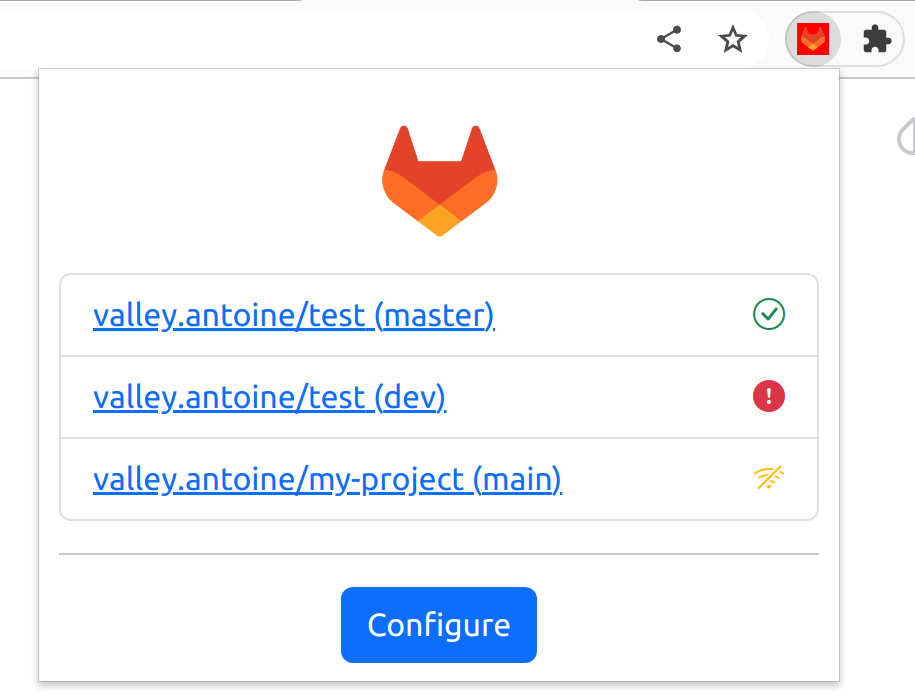
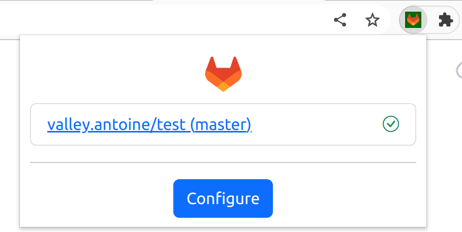
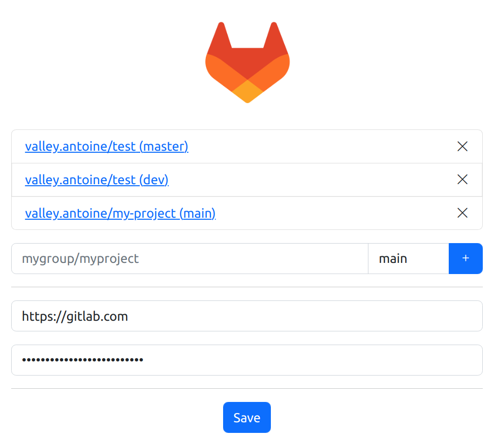

# Gitlab Monitoring - Chrome Extension

Initially made
using [Chrome Extension Boilerplate with React 17 and Webpack 5](https://github.com/lxieyang/chrome-extension-boilerplate-react)


## Features

This extension let's you monitor your Gitlab pipelines:

For this it only requires an Gitlab access token with read-only rights to the projects you wan't to monitor.

- Configure you gitlab and access token
- Add some projects / branches you want to monitor
- You will be notified if a pipeline fails :
  - The extension icon will change color
  - A web notification will be triggered

## Screenshots





## Installation

The extension is currently not release in Chrome app store.

1. Download the [latest release](https://github.com/sparqueur/chrome-extension-gitlab-status/releases)
2. Unzip it
3. Load the extension on Chrome following:
   1. Access `chrome://extensions/`
   2. Check `Developer mode`
   3. Click on `Load unpacked extension`
   4. Select the `build` folder.

## Building and Running

### Procedures:

1. Check if your [Node.js](https://nodejs.org/) version is >= **14**.
2. Clone this repository.
3. Change the package's `name`, `description`, and `repository` fields in `package.json`.
4. Change the name of your extension on `src/manifest.json`.
5. Run `npm install` to install the dependencies.
6. Run `npm start`
7. Load your extension on Chrome following:
   1. Access `chrome://extensions/`
   2. Check `Developer mode`
   3. Click on `Load unpacked extension`
   4. Select the `build` folder.
8. Happy hacking.

## Packing

After the development of your extension run the command

```
$ NODE_ENV=production npm run build
```

Now, the content of `build` folder will be the extension ready to be submitted to the Chrome Web Store. Just take a look at the [official guide](https://developer.chrome.com/webstore/publish) to more infos about publishing.

## Secrets

If you are developing an extension that talks with some API you probably are using different keys for testing and production. Is a good practice you not commit your secret keys and expose to anyone that have access to the repository.

To this task this boilerplate import the file `./secrets.<THE-NODE_ENV>.js` on your modules through the module named as `secrets`, so you can do things like this:

_./secrets.development.js_

```js
export default { key: '123' };
```

_./src/popup.js_

```js
import secrets from 'secrets';
ApiCall({ key: secrets.key });
```

:point_right: The files with name `secrets.*.js` already are ignored on the repository.

## Resources:

- [Webpack documentation](https://webpack.js.org/concepts/)
- [Chrome Extension documentation](https://developer.chrome.com/extensions/getstarted)
